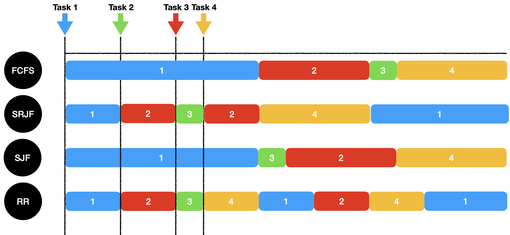
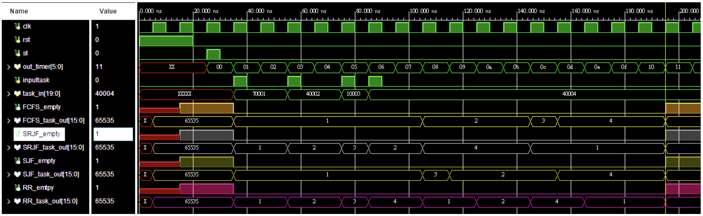
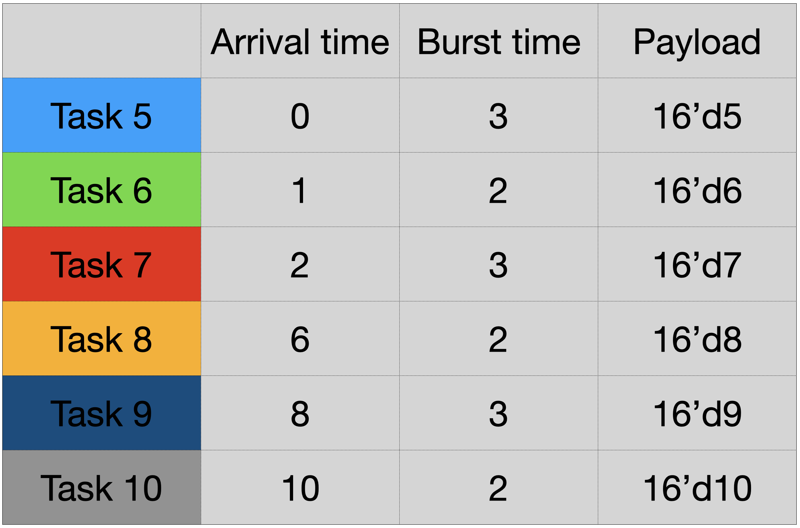
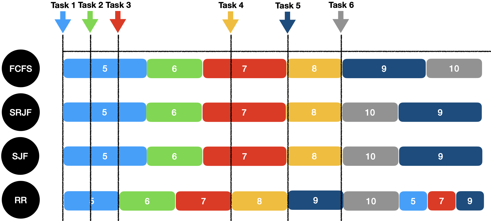
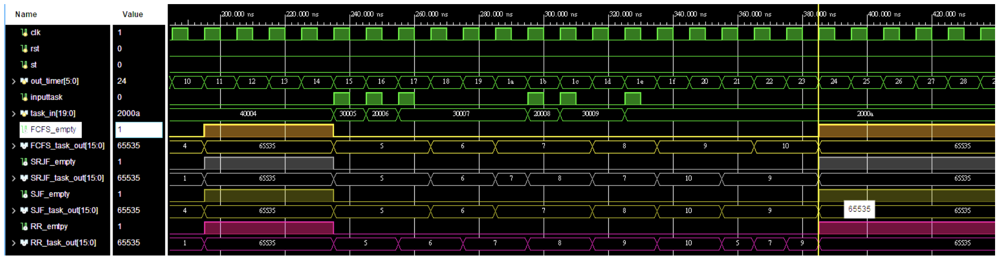
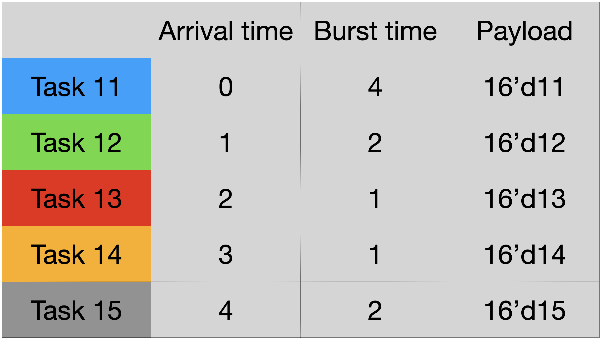
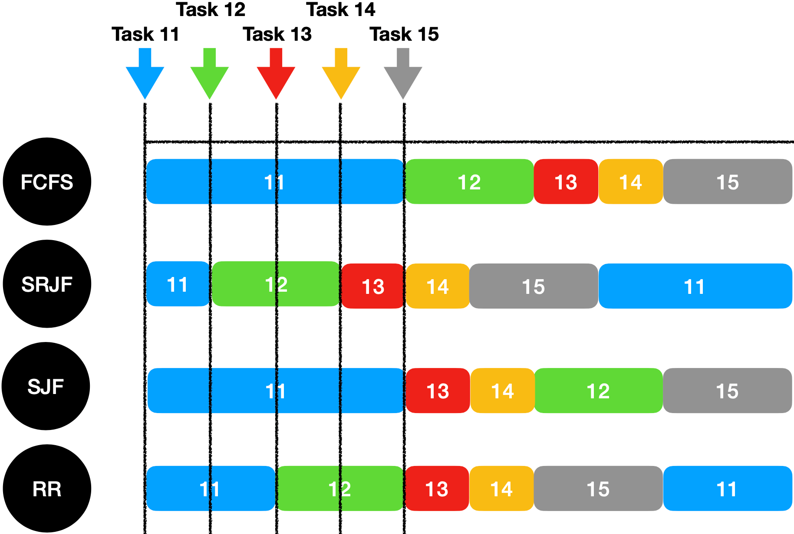
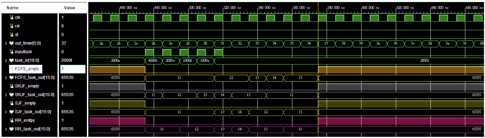

# Combinational Task Scheduling module

        

A hardware task scheduler design.

## Scheduling Algorithm Module I/O ports

```
module Scheduling_Algorithm( input clk,
                             input rst,
                             input st,
                             input inputtask,
                             input[20-1 : 0] task_in,
                             output empty,
                             output reg [16-1 : 0] task_out
                           );
```

|  I/O    | Signal name  | Signal definition
|----|:----|:---|
| input  | clk |clock signal|
| input  | rst |synchronous resert signal|
| input  | st  |signal to start the module
|input |inputtask| raised when there's a task comming into the scheduler
|output |empty | fired when no task under schedule
|output|task_out |output the scheduled task under current cycle

## Scheduling Algorithms
### 1.First-Come, First Served

*simplest scheduling algorithm*
- Abbreviated as FCFS
- Task that request first gets allocated first
- Usually comes with a **long waiting time**
- May lead to **convoy effect** - all tasks wait for a big one to get off


| |Arrival time|Burst time|Payload
|:---|:--:|:--:|:--:|
Task 1|0 |7| 16’d1|
Task 2|2 |4 |16’d2|
Task 3|4 |1 |16’d3|
Task 4|5 |4 |16’d4|

### 2.Shortest Remaining Job First
*preemptive version of Shortest Job First(SJF)*

- Abbreviated as SRJF
- Prioritize the task with shortest remaining time
- Advantageous because short processes are handled very quickly 
- Has the potential for **starvation** - high priority task keep executing and low priority ones get blocked for indefinite time


### 3.Shortest Job First
*a non-preemptive approach*

- Abbreviated as SJF
- Task having the smallest execution time is chosen for the next execution
- May cause very **long turnaround times**
- Also has the potential for **starvation**


### 4.Round Robin
*everyone gets to play*

- Abbreviated as RR
- Each task is assigned a fixed time slot in a cyclic way 
- Doesn’t face the issues of convoy effect or starvation.
- Depends on the selection of time quantum.
  - If too big, it degrades into FCFS.
  - If too small, overhead of content switching is too high

## Testbench

### 1.Test 1
*4 Tasks on all above mentioned scheduling algorithms*


 



### 2.Test 2
*6 Tasks on all above mentioned scheduling algorithms*


 


### 2.Test 2
*5 Tasks on all above mentioned scheduling algorithms*


 


---
Parts of the contribution in FCFS model and SRJF module is made by Eric Chun-Yu
